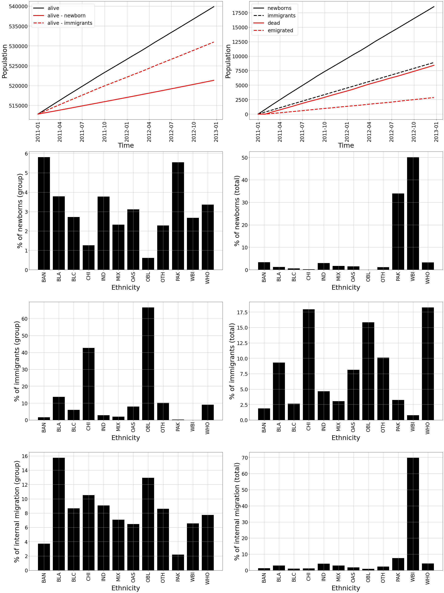
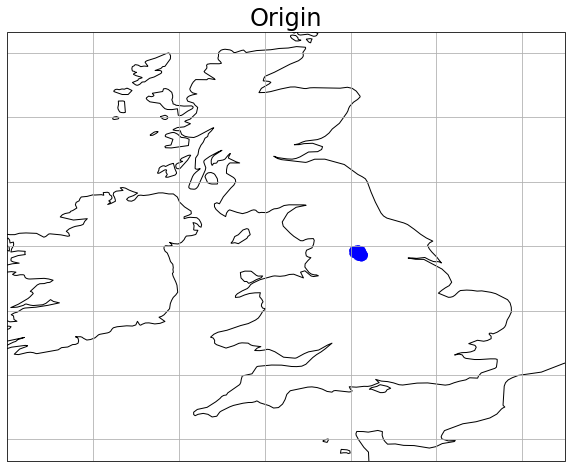
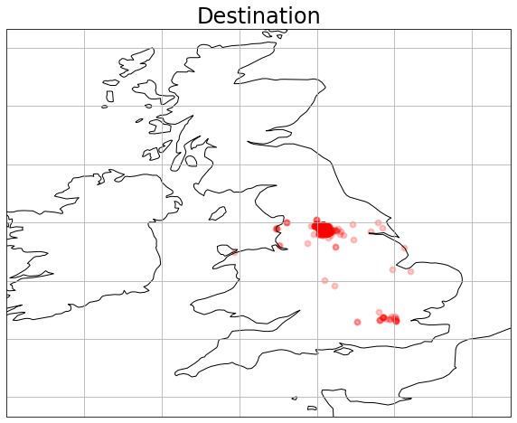

<div align="center">
    <h1>Daedalus</h1>
</div>
 
<p align="center">
    <!--- <a href="https://zenodo.org/badge/latestdoi/232834194">
        
    </a> --->
    <a href="https://travis-ci.com/alan-turing-institute/daedalus.svg?branch=develop">
        
    </a>
    <a href="https://github.com/alan-turing-institute/daedalus/blob/develop/LICENSE">
        
    </a>
    <br/>
</p>

*Daedalus* is a novel dynamic spatial microsimulation pipeline that allows users to produce (custom) population projections for policy intervention analysis.
Currently, it provides simulation utilities for the whole of the United Kingdom at the local authority (LA) level.

*Daedalus* is being developed in collaboration between Leeds Institute for Data Analytics and [the Alan Turing Institute](https://www.turing.ac.uk/) as 
part of the SPENSER (Synthetic Population Estimation and Scenario Projection Model) project.

Table of contents
-----------------

- [Installation and setup](#installation)
- [Tutorials](#tutorials)
    * [Run Daedalus via command line](#run-daedalus-via-command-line)
    * [Speeding up simulations over several LADs by parallelization](#speeding-up-simulations-over-several-lads-by-parallelization)
    * [Evaluation](#evaluation)
    * [Preparing datasets](#preparing-datasets)
    * [Configuration file](#configuration-file)

# Installation 

We strongly recommend installation via Anaconda:

* Refer to [Anaconda website and follow the instructions](https://docs.anaconda.com/anaconda/install/).

* Create a new environment for *Daedalus*:

```bash
conda create -n daedalus python=3.7
```

* Activate the environment:

```bash
conda activate daedalus
```

* Clone *Daedalus* source code:

```bash
git clone https://github.com/alan-turing-institute/daedalus.git
```

* Install *Daedalus* and its dependencies:

```
cd /path/to/my/daedalus
pip install -v -e .
```

# Tutorials

## Run Daedalus via command line

*Daedalus* can be run via command line. The following command displays all available options:

```bash
python scripts/run.py --help
```

Output:

```bash
usage: run.py [-h] -c config-file [--location LOCATION]
              [--input_data_dir INPUT_DATA_DIR]
              [--persistent_data_dir PERSISTENT_DATA_DIR]
              [--output_dir OUTPUT_DIR]

Dynamic Microsimulation

optional arguments:
  -h, --help            show this help message and exit
  -c config-file, --config config-file
                        the model config file (YAML)
  --location LOCATION   LAD code
  --input_data_dir INPUT_DATA_DIR
                        directory where the input data is
  --persistent_data_dir PERSISTENT_DATA_DIR
                        directory where the persistent data is
  --output_dir OUTPUT_DIR
                        directory where the output data is saved
```

For example, to run a simulation for LAD `E08000032`:

:warning: This takes around 2 to 3 hours (depending on your machine) to finish.

```bash
python scripts/run.py -c config/default_config.yaml --location E08000032 --input_data_dir data --persistent_data_dir persistent_data --output_dir output
```

In the above command:

* -c: the model config file in YAML format. For more information on the configuration file, 
refer to [section: Configuration file](#configuration-file).
* --location: target LAD code, here `E08000032`. Note that, *Daedalus* can be run in parallel for several LADs, 
refer to [section: Speeding up simulations over several LADs by parallelization](#speeding-up-simulations-over-several-lads-by-parallelization)
* --input_data_dir: the parent directory where population file is stored, e.g., `data` where `ssm_E08000032_MSOA11_ppp_2011.csv` is located.
* --persistent_data_dir: the parent directory that contains all persistent data, e.g., rates, OD matrices and etc,
refer to [section: Preparing datasets](#preparing-datasets) for details.
* --output_dir: directory where the output files will be stored.

As an example, when running the above command, *Daedalus* store the results in the following directory structure:

```bash
output
└── E08000032
    ├── config_file_E08000032.yml
    ├── ssm_E08000032_MSOA11_ppp_2011_processed.csv
    ├── ssm_E08000032_MSOA11_ppp_2011_simulation.csv
    ├── year_1
    │   └── ssm_E08000032_MSOA11_ppp_2011_simulation_year_1.csv
    └── year_2
        └── ssm_E08000032_MSOA11_ppp_2011_simulation_year_2.csv
```

with the following messages on the terminal:

```text
❯ python scripts/run.py -c config/default_config.yaml --location E08000032 --input_data_dir data --persistent_data_dir persistent_data --output_dir output                                                                                                                                                                                                        ─╯

Start Population Size: 524213
Write config file successful

Write the dataset at: output_single/E08000032/ssm_E08000032_MSOA11_ppp_2011_processed.csv
Computing immigration OD matrices...
Computing internal migration rate table...
Caching rate table...
Cached to persistent_data/internal_migration_rate_table_1.csv
Computing mortality rate table...
Caching rate table...
Cached to persistent_data/mortality_rate_table_1.csv
Computing fertility rate table...
Caching rate table...
Cached to persistent_data/fertility_rate_table_1.csv
Computing emigration rate table...
Caching rate table...
Cached to persistent_data/emigration_rate_table_1.csv
Computing immigration rate table...
Caching rate table...
Cached to persistent_data/immigration_rate_table_E08000032_1.csv
Computing total immigration number for location E08000032
Start simulation setup
2020-10-30 10:18:26
2020-10-30 10:18:26.363 | DEBUG    | vivarium.framework.values:register_value_modifier:373 - Registering metrics.1.population_manager.metrics as modifier to metrics
2020-10-30 11:05:54.951 | DEBUG    | vivarium.framework.values:_register_value_producer:323 - Registering value pipeline int_outmigration_rate
.
.
.
2020-10-30 13:58:07.094 | DEBUG    | vivarium.framework.engine:step:140 - 2012-12-01 01:30:00
Finished running simulation for year: 2
2020-10-30 14:01:03

In year:  2013
alive 539883
dead 8797
emigrated 2984
internal migration 551664
New children 18547
Immigrants 8904
Finished running the full simulation
alive 539883
dead 8797
emigrated 2984
internal migration 551664
New children 18547
Immigrants 8904
```

## Speeding up simulations over several LADs by parallelization

In the previous [section](#run-daedalus-via-command-line), we ran the simulation over one LAD (specified by `--location E08000032`).
The simulation took around 2 to 3 hours to finish. 
To speed up the simulations over severals LADs, *Daedalus* can be run in parallel. 
For example, the following command runs various LAD codes (specified by  `--path_pop_files "data/ssm_*ppp*csv"`, wildcard accepted) 
on five processes in parallel (specified by `--process_np 5`):

```bash
python scripts/parallel_run.py -c config/default_config.yaml --path_pop_files "data/ssm_*ppp*csv" --input_data_dir data --persistent_data_dir persistent_data --output_dir output --process_np 5
```

In this command:

* -c: the model config file in YAML format. For more information on the configuration file, 
refer to [section: Configuration file](#configuration-file).
* --path_pop_files: path to population files, wildcard accepted. 
LAD codes are extracted from the filenames specified in this argument, e.g., 
in the example, `--path_pop_files "data/ssm_*ppp*csv"`, LAD codes of all files `ssm_*ppp*csv` will be used. 
* --input_data_dir: the parent directory where population file is stored, e.g., `data` where `ssm_*ppp*csv` are located.
* --persistent_data_dir: the parent directory that contains all persistent data, e.g., rates, OD matrices and etc,
refer to [section: Preparing datasets](#preparing-datasets) for details.
* --output_dir: directory where the output files will be stored.
* --process_np: number of processors to be used.
All detected LAD codes will be distributed over the requested number of processes.

The following command displays all available options:

```bash
python scripts/parallel_run.py --help
```

## Evaluation 

After running the simulation in [section: Run Daedalus via command line](#run-daedalus-via-command-line), 
the results are stored in a directory specified by `--output_dir`, e.g., `output` in the command above.
In our example, it contains the following dirs/files:

```bash
output
└── E08000032
    ├── config_file_E08000032.yml
    ├── ssm_E08000032_MSOA11_ppp_2011_processed.csv
    ├── ssm_E08000032_MSOA11_ppp_2011_simulation.csv
    ├── year_1
    │   └── ssm_E08000032_MSOA11_ppp_2011_simulation_year_1.csv
    └── year_2
        └── ssm_E08000032_MSOA11_ppp_2011_simulation_year_2.csv
```

To evaluate the results, we need to:
1. reassign the migrants to the correct LADs. 
For example, people who migrated from `LAD_code_1 ---> LAD_code_2` should be added to the population file of `LAD_code_2`.
This step is required since *Daedalus* works and stores the results at LAD level.

:warning: Note that in the example of [section: Run Daedalus via command line](#run-daedalus-via-command-line),
we simulated only one directory. However, in realistic examples, more than one LAD will be stored in `output` directory. 

2. run validation code on the resulting population files.

The above two steps can be run via one command line:

```bash
XXX
python scripts/validation.py --simulation_dir output --persistent_data_dir persistent_data
```

* --simulation_dir: directory where the simulated population files are stored, i.e., 
output directory of a *Daedalus* simulation.
* --persistent_data_dir: the parent directory that contains the following ONS files: 
    - MYEB2_detailed_components_of_change_series_EW_(2019_geog20).csv 
    - MYEB3_summary_components_of_change_series_UK_(2019_geog20).csv

:warning: Note that the above command requires the following directory structure 
(created by *Daedalus* command line in [section: Run Daedalus via command line](#run-daedalus-via-command-line)):

```bash
XXX
output
└── E08000032
    ├── config_file_E08000032.yml
    ├── ssm_E08000032_MSOA11_ppp_2011_processed.csv
    └── ssm_E08000032_MSOA11_ppp_2011_simulation.csv
    └── year_1
          └── ssm_E08000032_MSOA11_ppp_2011_simulation_year_1.csv
    └── year_2
          └── ssm_E08000032_MSOA11_ppp_2011_simulation_year_2.csv
```

The following command displays all available options:

```bash
python scripts/validation.py --help
```

XXXX

Next, we will evaluate and plot the results in this [notebook](https://github.com/BenjaminIsaac0111/daedalus/blob/feature/refactoring_pipeline/notebooks/pipeline_results_evaluation_plots.ipynb).

<p align="center">

</p>

In another [notebook](https://github.com/BenjaminIsaac0111/daedalus/blob/feature/refactoring_pipeline/notebooks/pipeline_results_maps.ipynb),
the results are plotted on maps. 
We use the `cartopy` library to plot maps in this notebook. 
`cartopy` is not installed by default. Please follow the instructions here:

https://scitools.org.uk/cartopy/docs/latest/installing.html

<p align="center">

</p>

<p align="center">

</p>

## Preparing datasets

The following directories/files are needed to run a *Daedalus* simulation:

* Configuration file. Refer to [section: Configuration file](#configuration-file). 
* Directory that contains persistent datasets, e.g., 
rate files (mortality, fertility, ...), OD matrices. See `persistent_data` directory on the repo.
* For validation, the following files are needed:
    - MYEB2_detailed_components_of_change_series_EW_(2019_geog20).csv 
    - MYEB3_summary_components_of_change_series_UK_(2019_geog20).csv
They are also stored in the `persistent_data` directory on the repo.
* Directory that contains population files. For example, see `data` directory on the repo.

## Warning ⚠️

If you are planning to run the microsimulation pipeline on the LADs 
`E09000001`, `E09000033`, `E06000052` and `E06000053` beware that 
the rates of these LADs are merged in the following way:

- `E09000001+E09000033`
- `E06000052+E06000053`

(For all other LADs, the rates are at individual level).

It is still possible to run the simulations for `E09000001`, `E09000033`, `E06000052` and `E06000053` individually, 
but the pipeline will use the combined rates and immigrated values as specified above. 

The most appropriate way to deal with this is to run the microsimulation from a combined LAD starting file, 
instead of individually. For example, to run the simulation for the LADs `E09000001+E09000033`, 

1. Create a file named: `ssm_E09000001+E09000033_MSOA11_ppp_2011.csv` that contains 
the starting population from both `E09000001` and `E09000033`.
2. Run the pipeline in the following way:

```bash
python scripts/run.py -c config/default_config.yaml --location E09000001+E09000033 --input_data_dir data --persistent_data_dir persistent_data --output_dir output
```

Similarly, this should be done for `E06000052+E06000053` 

## Configuration file

*Daedalus* reads a config file specified by `-c` flag 
(see [section: Run Daedalus via command line](#run-daedalus-via-command-line)).
An example config file is provided on the repo, see: https://github.com/alan-turing-institute/daedalus/blob/feature/10-documentation/config/default_config.yaml

This config file contains the following options:

```yaml
randomness:
    key_columns: ['entrance_time', 'age']
input_data:
    location: 'UK'
time:
    start: {year: 2011, month: 1, day: 1}
    end:   {year: 2012, month: 1, day: 1}
    step_size: 30.4375  # Days
    num_years: 2
population:
    age_start: 0
    age_end: 100

mortality_file: 'Mortality2011_LEEDS1_2.csv'
fertility_file: 'Fertility2011_LEEDS1_2.csv'
emigration_file: 'Emig_2011_2012_LEEDS2.csv'
immigration_file: 'Immig_2011_2012_LEEDS2.csv'
total_population_file: 'MY2011AGEN.csv'
msoa_to_lad: 'Middle_Layer_Super_Output_Area__2011__to_Ward__2016__Lookup_in_England_and_Wales.csv'
OD_matrix_dir: 'od_matrices'
OD_matrix_index_file: 'MSOA_to_OD_index.csv'
internal_outmigration_file: 'InternalOutmig2011_LEEDS2.csv'
immigration_MSOA : 'Immigration_MSOA_M_F.csv'
ethnic_lookup: 'ethnic_lookup.csv'
components : [TestPopulation(),InternalMigration(), Mortality(), Emigration(), FertilityAgeSpecificRates(),Immigration()]
scale_rates:
    # methods:
    # constant: all rates regardless of age/sex/... will be multiplied by the specified factor
    #           if 1, the original rates will be usd
    method: "constant"
    constant:
        mortality: 1
        fertility: 1
        emigration: 1
        immigration: 1
        internal_migration: 1
```

